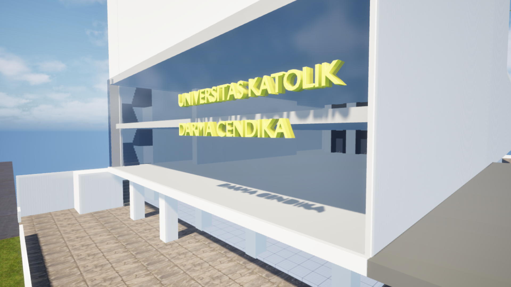

# 🏛️ UKDC Virtual Campus Tour

> Jelajahi kampus Universitas Klabat secara interaktif — temui NPC, eksplorasi gedung, dan kenali fasilitas kampus dalam lingkungan 3D real-time.

---

## 🎮 Tentang Proyek

UKDC Virtual Campus Tour adalah aplikasi tur kampus interaktif berbasis game yang dibangun dengan **Unreal Engine 5**. Dibuat untuk pameran kampus, proyek ini memungkinkan calon mahasiswa dan pengunjung untuk:

- 🚶 Berjalan secara bebas di lingkungan kampus 3D
- 💬 Berinteraksi dengan NPC (staf & dosen) melalui sistem dialog RPG
- 🛗 Menggunakan elevator antar lantai
- 🎓 Mengenal fasilitas akademik, IT Center, dan laboratorium

---

## ✨ Fitur

| Fitur | Status |
|---|---|
| Third-person character controller | ✅ Done |
| Dialog system (NPC RPG-style) | ✅ Done |
| Elevator system (teleport + camera fade) | ✅ Done |
| Cinematic main menu | ✅ Done |
| Character gender selection | ✅ Done |
| Side-quest system | 🔄 Planned |
| VR (Oculus) support | 🔄 Planned |

---

## 🖥️ Minimum Spesifikasi

| Komponen | Minimum |
|---|---|
| OS | Windows 10/11 64-bit |
| GPU | NVIDIA GTX 1060 / AMD RX 580 |
| RAM | 8 GB |
| Storage | 3 GB free |
| DirectX | Version 11 |
| Internet | Tidak diperlukan |

---

## 📦 Download & Instalasi

1. Download file ZIP dari [**Releases**](https://github.com/Nathanaelcpt/ukdc-campus-tour/releases/latest)
2. Extract ke folder mana saja
3. Jalankan `UKDCTourCampus.exe`
4. Tidak perlu instalasi tambahan

---

## 🎮 Kontrol

| Tombol | Aksi |
|---|---|
| `W A S D` | Gerak karakter |
| `Mouse` | Putar kamera |
| `E` | Interaksi / Dialog NPC |
| `Click` | Lanjutkan dialog / Pilih opsi |
| `Esc` | Pause / Menu |

---

## 🏗️ Dibangun Dengan

- **[Unreal Engine 5](https://www.unrealengine.com/)** — Game engine & Blueprint scripting
- **Mixamo** — Animasi karakter
- **UMG (Unreal Motion Graphics)** — UI/Widget system
- **DataTables** — Manajemen konten dialog NPC

---

## 📸 Screenshot

---

## 👤 Author

**Nathanael** — [@Nathanaelcpt](https://github.com/Nathanaelcpt)

---

  Universitas Klabat © 2026

